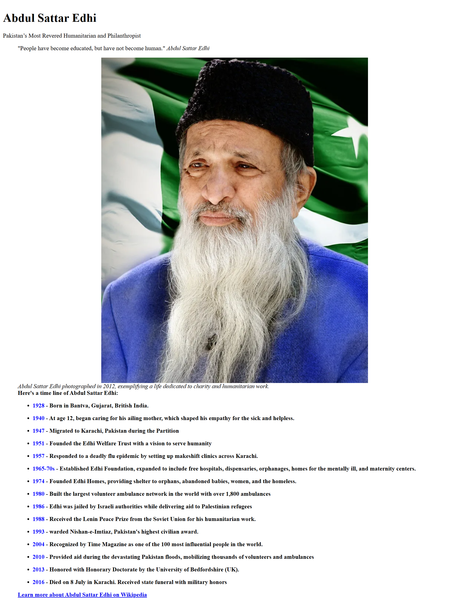

# 🌟 Tribute Page Project

A simple and elegant **Tribute Page** built using **HTML5** and **CSS3**, created as part of my web development learning journey. This project showcases my ability to create semantic structure and style content with responsiveness in mind.

---

## 🔗 Live Demo

👉 [Click here to view the live project](https://codewithokasha.github.io/Tribute-Page/)

---

## 📸 Screenshot

---

## 📚 Project Description

This tribute page is built to honor a notable personality, using clean semantic HTML, styled with modern CSS. It demonstrates my skills in:

- Structuring a layout using HTML5
- Styling with CSS3 including typography and spacing
- Making a visually pleasing responsive design
- Hosting and deploying with GitHub Pages

---

## 🛠️ Technologies Used

- HTML5
- CSS3

---

## 📂 Folder Structure

